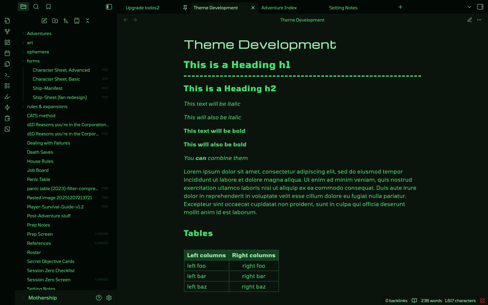
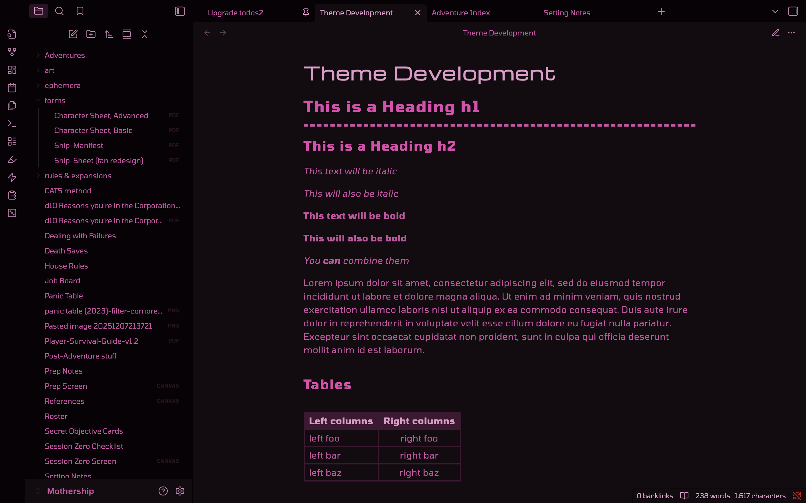
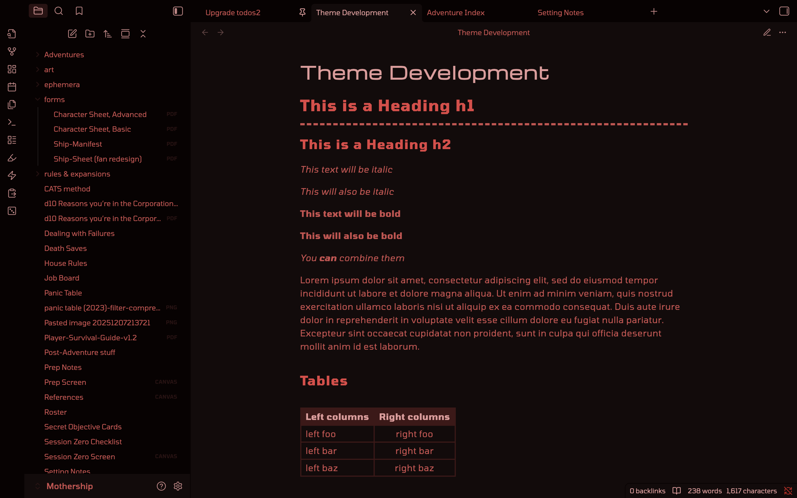
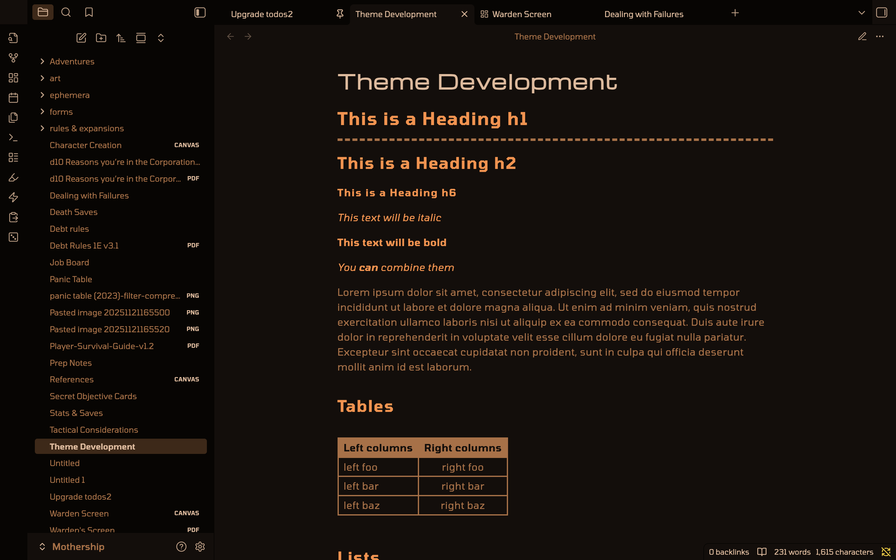
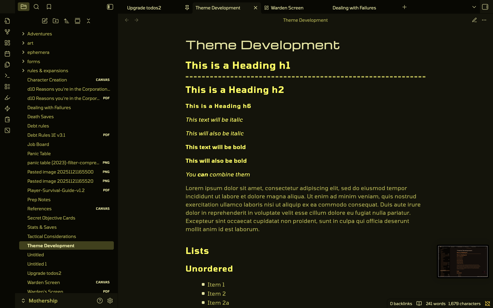
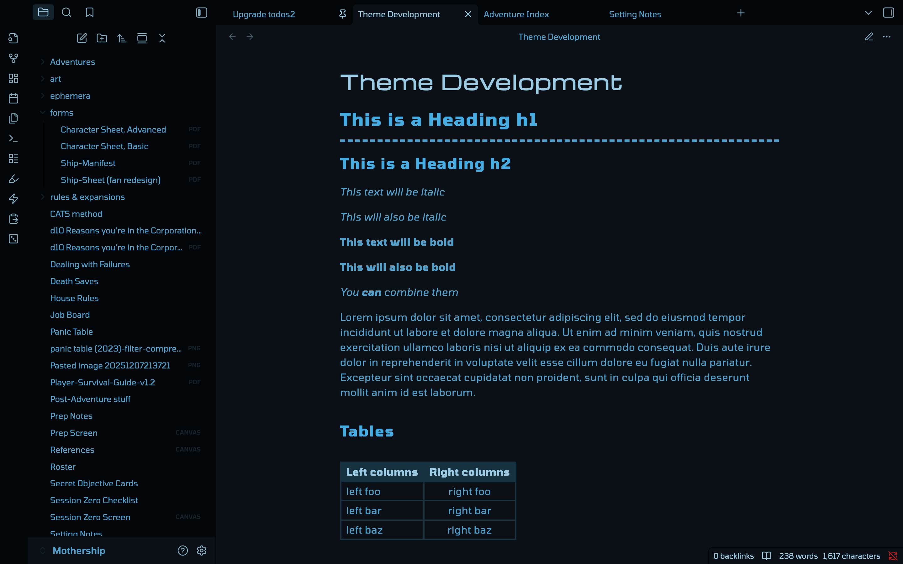
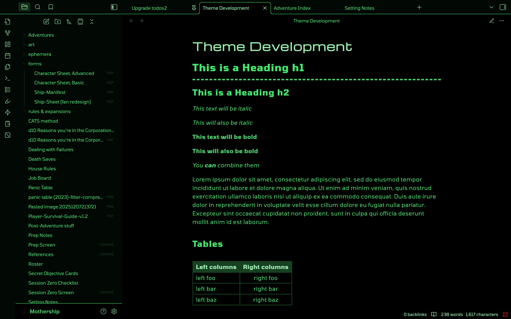
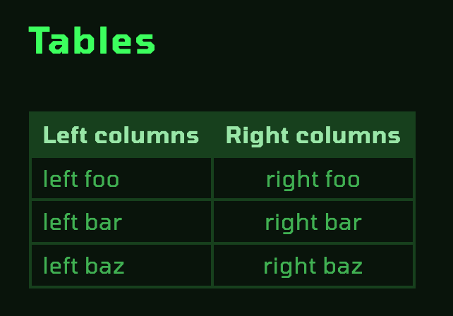
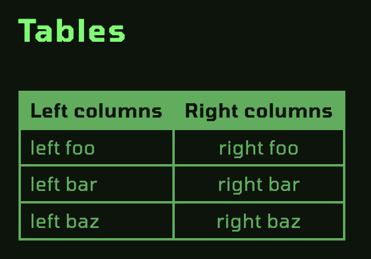

A theme for [Obsidian](https://obsidian.md/) based on computer consoles depicted in popular '80s sci-fi films.

"Starlit Abyss" is based on Satchelmouth's [WYConsole Theme](https://github.com/Satchelmouth/Obsidian-Theme-WYConsole).

**This theme requires the [Style Settings](https://github.com/mgmeyers/obsidian-style-settings) plugin.** While the theme _should_ work without it, several features listed below require the plugin in order to be switched on.

## Installation
### Method 1: Obsidian Community Store (Recommended)
This method will auto-update when a new version is released.

1.  Open **Settings** > **Appearance**.
2.  Click **Manage** next to Themes.
3.  Search for **"Starlit Abyss"**.
4.  Click **Install** and then **Enable**.

### Method 2: Manual Installation
1.  Download `theme.css` and `manifest.json` from the Releases page.
2.  Go to your vault folder: `.obsidian/themes/`.
3.  Create a folder named `Starlit Abyss`.
4.  Paste the files there.
5.  Select **Starlit Abyss** in Obsidian Settings.

## Features
### Color themes
|                                                        |                                                       |
|:------------------------------------------------------:|:-----------------------------------------------------:|
|   *Terminal Green*  |      *CyberPink*     |
|    *Rogue AI Red*   |  *Ominous Orange* |
|  *Ypsilon Yellow* |   *Moonbase Blue*  |

There is also an option to use Obsidian's accent color to set the hue.

### Multiple fonts:
- [ ] TODO: Screenshot here

### OLED mode (pure black background):

### Additional "inverted table" style:

| Normal table | Inverted table |
|:---:|:---:|
|  |  |

## Supported Plugins
* [Style Settings](https://github.com/mgmeyers/obsidian-style-settings) *(required for style options listed above)*
* [Advanced Tables](https://github.com/tgrosinger/advanced-tables-obsidian)
* [Sheets Extended](https://github.com/NicoNekoru/obsidan-advanced-table-xt)
* Kanban
* Calendar
* File Tree Alternative Plugin
* [April's Automatic Timelines](https://github.com/April-Gras/obsidian-auto-timelines)

## Wishlist & Known Issues

- Custom caret *- unfortunately, I'm SOL on this one until CSS 4 drops and Obsidian integrates it. The general idea is to make the caret a box caret, like on old computer terminals. If anyone knows a way to accomplish this via JS, a PR is more than welcome.*
- Canvas 
	- Changing a connection's arrowhead's color is not currently possible. It's not a CSS selectable object.
	- Some strange 1px grey borders will show when viewing a table header row via a Canvas embed, but not when in direct Reading or Editing views of those same notes.
- Some way for black text/white page PDF files to be recolored to match the theme
